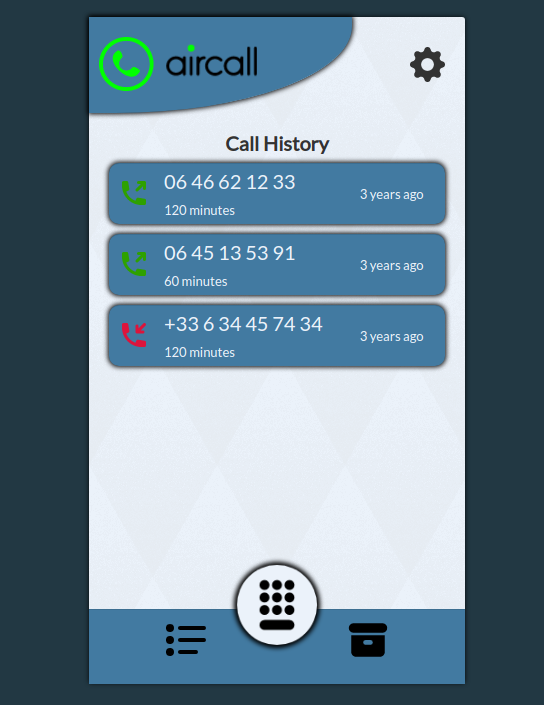
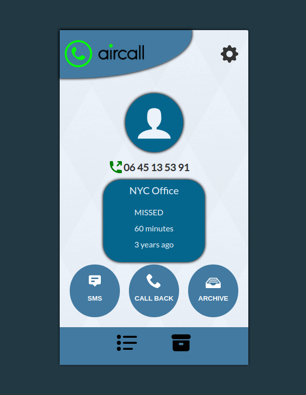

# Aircall

Aircall is a miniature simplistic concept app that mimics the call history on a user's phone. Using an API to retrieve fake data it builds a list of past phone calls and gives the user the option to see more details, or even archive each individual call. 

Once archived, a call can then be viewed under the archive tab where you can view more details and even un-archive a chosen call. This project was built in 24 hours using React.js. This was completed as a technical assessment.

### [Try it out!](https://kf-aircall.netlify.app/)

## Features

- Users can view past call history
- Users can view more details about each call
- Users can see which calls were incoming and outgoing
- Users can Archive past calls
- Users can view archived calls
- Users can unarchive previously archived calls
- Users can easily switch from one tab to another

## Screenshots

## Setup

Install dependencies with `yarn` in the root` directory

## Running Webpack Development Server

`yarn start`

## Dependencies

- React
- Babel
- Webpack
- Axios
- Timeago
- React-icons

## Testing Options:

- Jest (If more than 24 hours)

## Contributors

This project is made possible by:

- [Kyle Forsyth](https://github.com/cupokyle)